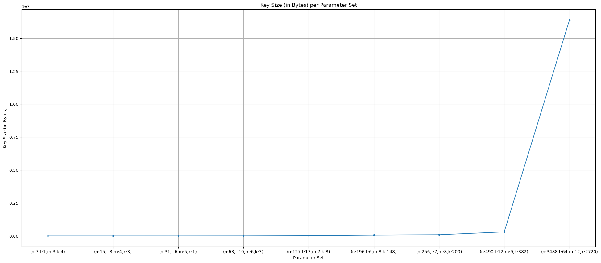
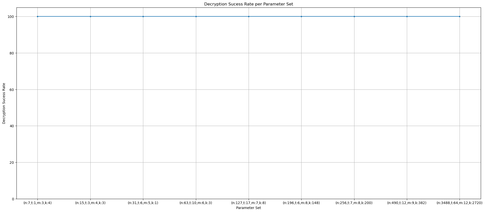
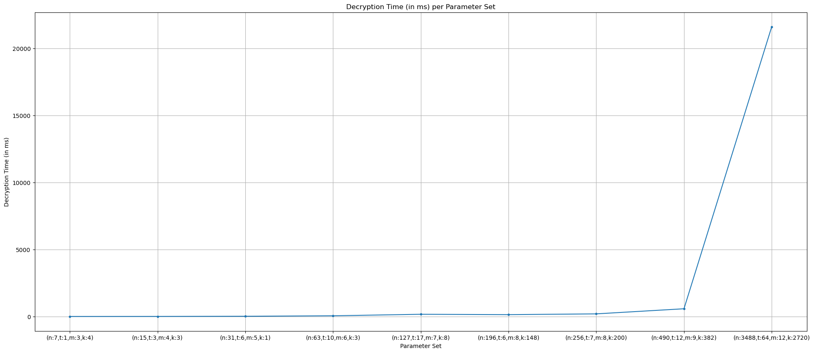
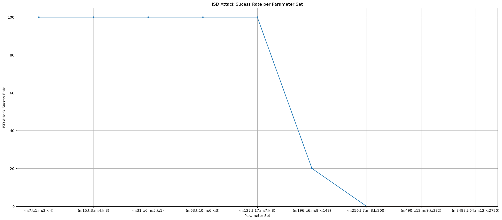
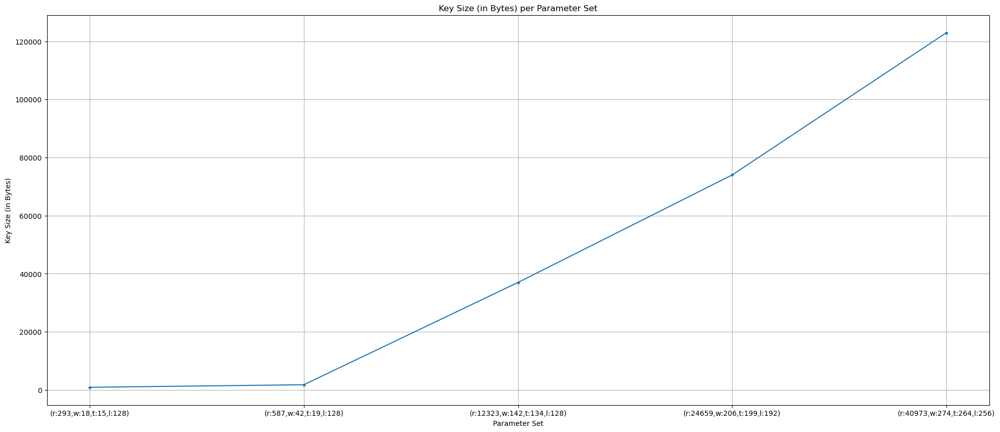
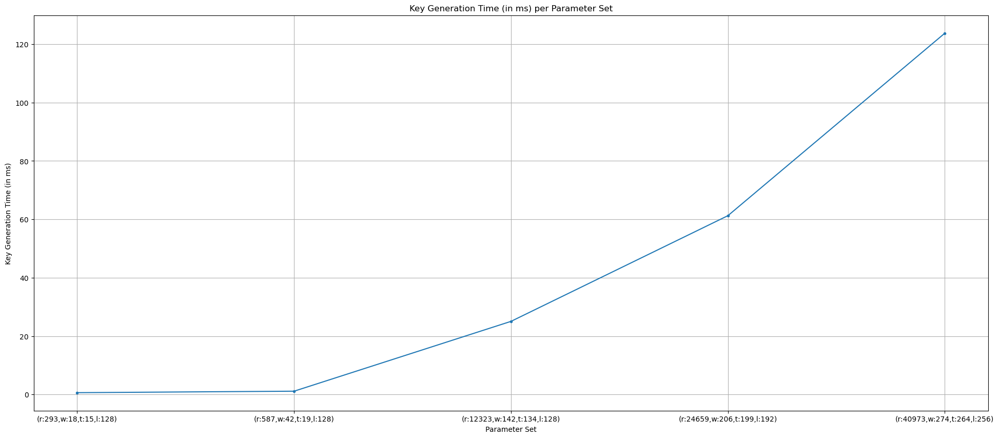
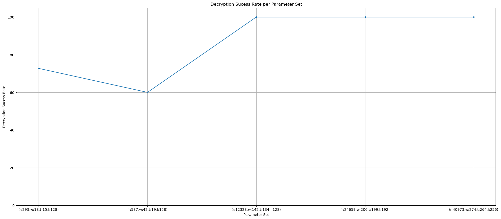
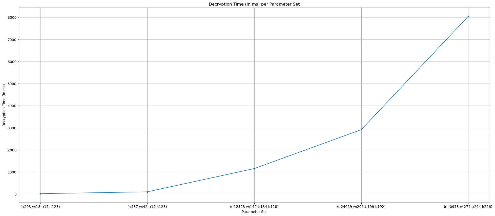
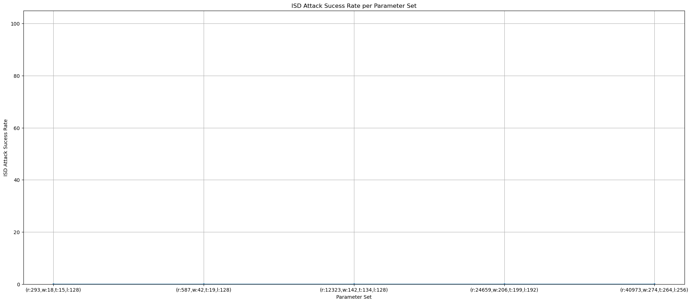

# Exercises on Code-Based Cryptography

### Analysis of Classic McEliece Cryptosystem

To evaluate the Classic McEliece cryptosystem, a predefined set of parameters was tested across five independent executions. Due to performance constraints and the objectives of these exercises, only the first official security level was considered. Since known attacks are ineffective at this level and higher security levels introduce significantly greater computational overhead, meaningful conclusions can be drawn from the evaluation of the first official security level together with lighter toy parameters.

Classic McEliece is a code-based public-key cryptosystem whose security relies on the hardness of decoding a general linear code, a problem believed to be resistant to both classical and quantum adversaries. However, this security comes at the cost of large key sizes and substantial computational overhead.

#### Key Generation

As shown in **Figure 1**, Classic McEliece public keys require a considerable amount of memory once the parameters approach the standardized values, even when restricted to the first official security level. The rapid growth in key size indicates that higher security levels would impose even more severe storage requirements.

This large memory footprint directly impacts performance. Generating such large keys is computationally expensive, which may pose challenges for deployment on resource-constrained devices or systems with limited memory availability.

The key generation times presented in **Figure 2** confirm this expectation. A sharp increase in computation time is observed when transitioning to the first official security level. This significant overhead can hinder practical adoption, particularly on low-performance machines, and raises concerns regarding the feasibility of standardizing Classic McEliece for environments with heterogeneous hardware capabilities.

#### Decryption

Despite the inefficiencies observed during key generation, Classic McEliece demonstrates excellent reliability during decryption. As illustrated in **Figure 3**, the decryption success rate is consistently 100% across all tested parameters. This behavior highlights the robustness of the decoding algorithm, ensuring that ciphertexts are reliably decrypted without errors.

Such reliability eliminates the need for retransmissions due to decryption failures, which is a significant advantage in communication systems.

Regarding decryption performance, **Figure 4** shows that decryption times also increase noticeably at the first security level. However, the growth is less dramatic than that observed for key generation, with decryption being approximately an order of magnitude faster than key generation. This suggests that while key generation is a major bottleneck, decryption remains comparatively manageable.

#### Attack

The effectiveness of Information Set Decoding (ISD) attacks against Classic McEliece was also evaluated. As shown in **Figure 5**, ISD attacks are fully successful against low-parameter instances, with success rates reaching 100% up to approximately \( n = 196 \), \( t = 6 \), and \( m = 8 \). Beyond this point, the success rate drops completely, reaching only 10% at the threshold point.

These results confirm that security critically depends on using the officially recommended parameter sets. Deploying parameters below this threshold would expose the system to efficient attacks, potentially even by quantum adversaries.

Furthermore, **Figure 6** indicates that successful attacks execute very quickly for weak parameter sets. This suggests that if future quantum algorithms further optimize ISD-based techniques, improperly configured systems could be compromised rapidly, posing a serious security risk.

#### Security Implications

The analysis highlights a fundamental trade-off inherent to the Classic McEliece cryptosystem. While it offers strong post-quantum security guarantees when standardized parameters are used, it does so at the cost of extremely large key sizes and expensive key generation. These characteristics may limit its applicability in bandwidth-constrained environments or on low-performance devices.

Nevertheless, its deterministic decryption and resistance to known quantum attacks make Classic McEliece a strong candidate for long-term security, particularly in scenarios where storage and computation are less constrained.

### Analysis of BIKE Cryptosystem

For the BIKE cryptosystem, a similar evaluation methodology was adopted. A predefined set of parameters was tested across ten independent executions. Unlike Classic McEliece, BIKE is significantly more efficient, allowing all official security levels to be evaluated within reasonable performance bounds.

BIKE is a quasi-cyclic code-based cryptosystem whose security relies on the hardness of decoding structured codes. Its design aims to reduce key sizes and improve efficiency while maintaining post-quantum security.

#### Key Generation

As illustrated in **Figure 7**, BIKE exhibits substantially smaller key sizes compared to Classic McEliece, even at its highest security level. The largest keys are approximately 120 KB in size, making them suitable for deployment on a wide range of systems, including legacy and resource-constrained devices.

This reduced key size translates directly into improved key generation performance. As shown in **Figure 8**, key generation times remain below 120 ms even for the strongest security parameters. This efficiency makes BIKE highly attractive for real-world applications where frequent key generation is required.

The combination of strong security guarantees and low overhead suggests that BIKE’s highest security level offers robust protection against quantum adversaries without sacrificing practicality.

#### Decryption

In contrast to Classic McEliece, BIKE exhibited non-perfect decryption success rates when using toy parameters, as shown in **Figure 9**. This behavior is expected, since BIKE requires careful parameter selection to minimize the probability of decoding errors. The toy parameters were not optimized with this constraint in mind.

However, for all official security levels, the decryption success rate was 100%, demonstrating that BIKE is reliable when deployed with properly chosen parameters.

The decryption performance shown in **Figure 10** further emphasizes BIKE’s efficiency. Even at the highest security level, decryption times remain below 8000 ms, a stark contrast to Classic McEliece. This makes BIKE suitable for use on a wide variety of platforms while maintaining high reliability and security.

#### Attack

No successful ISD attacks were observed against the BIKE cryptosystem, as shown in **Figure 11**. This outcome is partly due to the fact that the tested implementation was unable to generate keys within extremely weak parameter ranges where attacks might succeed.

Importantly, this implies that even the minimum supported parameter sets—already offering good performance—provide strong resistance against ISD attacks by classical adversaries.

#### Security Implications

The BIKE cryptosystem demonstrates a favorable balance between security and efficiency. Its small key sizes, fast key generation, and reliable decryption at official security levels make it well-suited for practical deployment, including in environments with limited computational resources.

While its reliance on structured codes necessitates careful parameter selection, the results indicate that BIKE achieves strong post-quantum security with significantly lower overhead than Classic McEliece. Consequently, BIKE represents a compelling alternative for applications seeking scalable and efficient quantum-resistant cryptography.