# Exercises on Lattice-Based Cryptography

### Analysis of the GGH/HNF cryptosystem

The GGH/HNF cryptosystem was evaluated through experimental testing across varying lattice dimensions, with each dimension parameter n tested 10 times to ensure statistical reliability. The testing framework examined three critical performance metrics: key size requirements, temporal efficiency, and decryption reliability.

#### Key Size

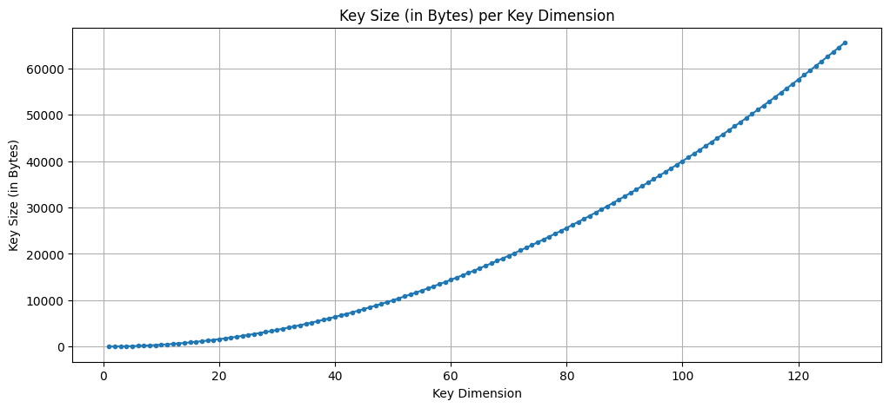

As illustrated in Figure 1, the key size exhibits an exponential relationship with the dimension parameter n. Starting from minimal storage requirements at low dimensions (approximately 500 bytes at n=2), the key size grows exponentially and predictably, reaching approximately 65,000 bytes at n=130. This exponential growth pattern is characteristic of lattice-based cryptosystems where the private key consists of basis vectors stored as integer matrices. The storage requirement can be expressed as O(n²), where each of the n basis vectors contains n integer coefficients. While this growth is manageable for moderate security parameters, it represents a significant consideration for resource-constrained environments, particularly when compared to traditional public-key cryptosystems like RSA or ECC.

#### Performance Analysis

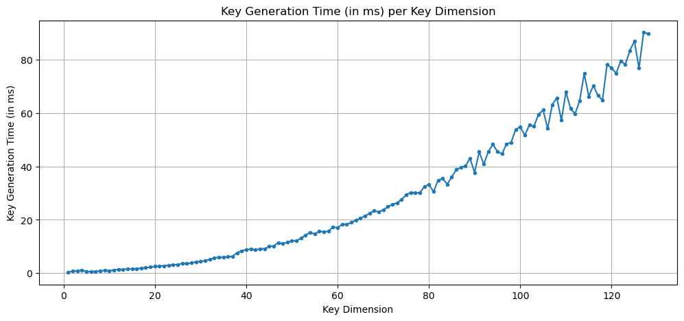

The temporal performance of the GGH/HNF cryptosystem demonstrates remarkable efficiency across both key generation and decryption operations for the defined parameter threshold. Key generation time (Figure 2) scales approximately exponentially with dimension, beginning at negligible values for small dimensions and reaching approximately 90 milliseconds at n=130. The graph shows some variance at higher dimensions, which is expected due to the probabilistic nature of generating well-conditioned lattice bases and the computational complexity of basis reduction operations during key generation.

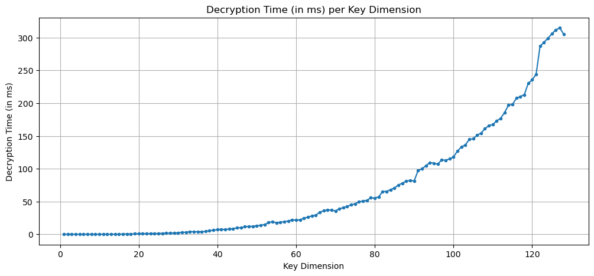

Decryption time (Figure 3) follows a similar exponential growth pattern, but remaining extremely efficient throughout the tested range. At the lowest dimensions, decryption operations complete in under 5 milliseconds, while even at the maximum tested dimension of n=130, decryption requires only approximately 310 milliseconds. This computational efficiency stems from the straightforward nature of the decryption operation, which primarily involves matrix-vector multiplication and rounding operations using the private basis. The smooth growth curve indicates that the algorithm scales predictably, making performance forecasting for larger parameters relatively straightforward.

Overall, the processing time of the GGH/HNF cryptosystem for this range is exceptionally low, with decryption times around 300 ms and key generation at approximately 80-90 ms for the highest tested parameters. These performance characteristics make the scheme practical for real-time cryptographic applications, provided these parameters are adequate for employed security constrains.

#### Decryption Success Rate

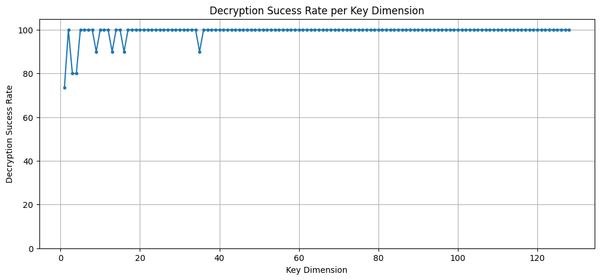

The decryption success rate (Figure 4) reveals interesting behavior at dimension boundaries. At very low dimensions (n < 5), the success rate exhibits instability, ranging from approximately 75% to 100%. This instability occurs because at extremely small dimensions, the lattice structure may not provide sufficient error tolerance, and the perturbation added during encryption can occasionally exceed the fundamental parallelepiped of the private basis, leading to decryption failures.

However, after only a few incremental increases in dimension (approximately n ≥ 10), the decryption success rate stabilizes at a consistent 100%. This stabilization demonstrates that once the lattice dimension is sufficient to accommodate the error distribution, the cryptosystem achieves perfect reliability. The occasional minor dips visible in the graph (such as the anomaly around n=35) are likely statistical artifacts from the finite sample size of 10 trials per dimension, rather than systematic failures. For practical implementations, this data suggests that any dimension above n=10 provides reliable decryption, and the choice of dimension should instead be driven by security considerations against lattice attacks.

### Analysis of the LLL attack in the GGH/HNF cryptosystem

The Lenstra-Lenstra-Lovász (LLL) lattice reduction algorithm represents the primary cryptanalytic threat to the GGH/HNF cryptosystem. Our experimental analysis evaluated both the success rate and computational cost of LLL-based attacks across the dimension spectrum.

#### Attack Success Rate

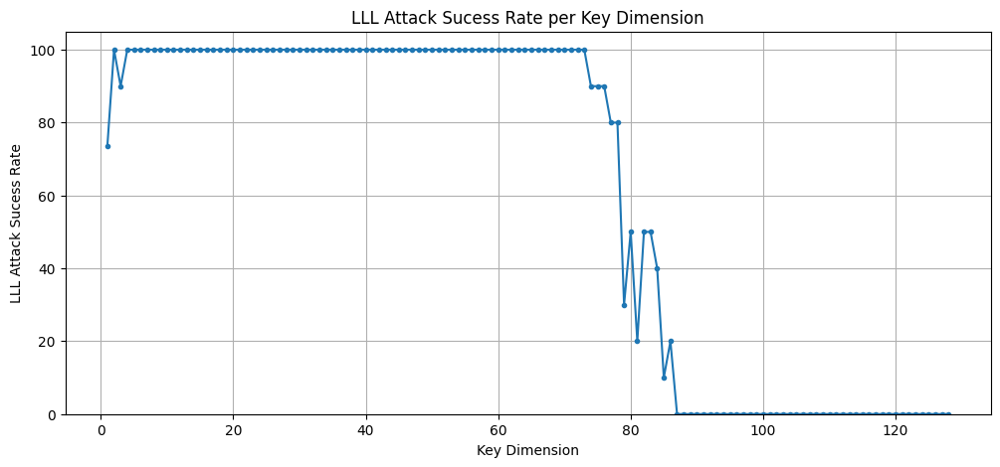

Figure 5 demonstrates a critical security threshold in the GGH/HNF cryptosystem. The LLL attack exhibits an approximately 100% success rate for dimensions up to n ≈ 75, with only minor failures at the very lowest dimensions (n < 3), which coincide with dimensions where legitimate decryption also fails. This extended range of vulnerability represents a significant security concern, as it indicates that any practical implementation must operate well beyond this threshold to achieve meaningful security.

The transition zone between n=75 and n=90 shows a dramatic collapse in attack effectiveness. The success rate drops precipitously from near 100% to below 50% within this narrow range, exhibiting a sharp sigmoidal decline. By dimension n=90, the attack success rate falls to approximately 20%, and by n=95, it becomes effectively negligible. This sharp transition suggests a fundamental limitation in the LLL algorithm's current ability to find sufficiently short vectors in higher-dimensional lattices, consistent with theoretical predictions about the exponential hardness of lattice problems as dimension increases.

#### Attack Processing Time

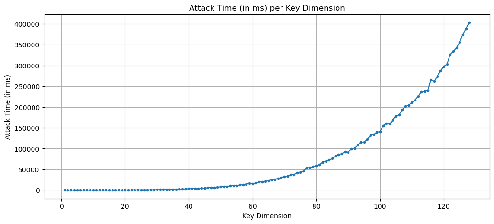

The computational cost of mounting LLL attacks, shown in Figure 6, reveals an exponential growth pattern with respect to dimension. At low dimensions (n < 20), attack times remain minimal, typically under 5,000 milliseconds (5 seconds). However, as dimension increases, the attack time grows exponentially, reaching approximately 50,000 ms (50 seconds) at n=80, 150,000 ms (2.5 minutes) at n=110, and exceeding 400,000 ms (6.7 minutes) at n=130.

This exponential growth reflects the increasing computational complexity of lattice basis reduction as the dimension grows. The LLL algorithm must perform increasingly many iterations, each involving Gram-Schmidt orthogonalization and integer operations on progressively larger vectors. While the absolute times remain within the realm of feasibility for an attacker with modest computational resources (minutes to hours), the trajectory suggests that dimensions beyond the tested range would quickly become computationally prohibitive.

Notably, the attack becomes both less successful and more computationally expensive in the same dimension range (n > 75), creating a double barrier to cryptanalysis. However, the data reveals a fundamental vulnerability: below n=75, the attack is both highly successful and computationally inexpensive, completing in under one minute even for dimension 75.

#### Security Implications

The experimental results expose a critical weakness in the GGH/HNF cryptosystem: it remains vulnerable to LLL attacks up to relatively high dimensions (n ≈ 75-85). For practical security, implementations must operate at dimensions where both the attack success rate is negligible and the computational cost is prohibitive, suggesting a minimum recommended dimension of n ≥ 90-100 based on this analysis.

The primary concern is that quantum computers could enable the LLL algorithm to perform better and faster, allowing it to find sufficiently short vectors in less time and at dimensions currently infeasible for classical machines. To counter this threat, the dimension parameter would need to be increased. However, escalating the dimension creates its own challenges: depending on the magnitude of increase required, the system could demand excessive computational resources, including memory and processing time, as this escalate exponentially. This presents a fundamental trade-off where the security parameters necessary to resist quantum-enhanced attacks may become impractical for real-world implementation.

### Analysis of the NTRU cryptosystem and the respective LLL attack

The NTRU (Nth-degree Truncated polynomial Ring Units) cryptosystem was evaluated across four distinct parameter sets, each tested 10 times to ensure statistical reliability. Unlike GGH/HNF where dimension varies continuously, NTRU uses discrete parameter configurations that balance security and performance. The parameter sets tested are denoted as (N, p, q, df), where N represents the polynomial degree, p and q are the small and large moduli respectively, and df determines the number of nonzero coefficients in the private key polynomial.

#### Key Size

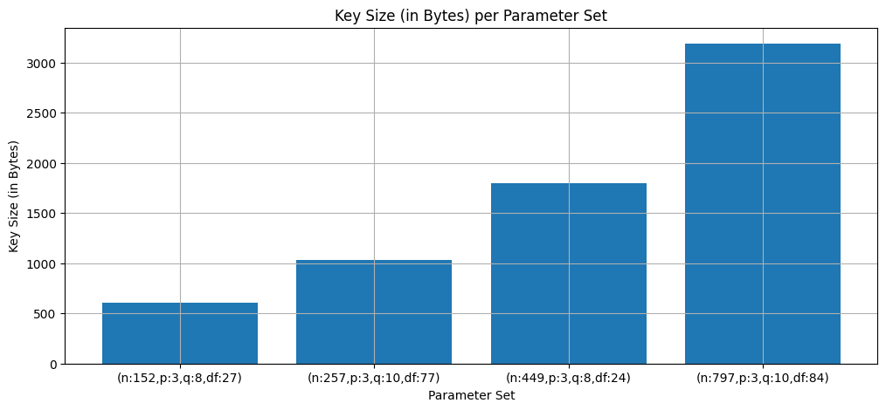

The key size analysis (Figure 7) reveals a linear and predictable growth pattern across parameter sets. The smallest parameter set (n:152, p:3, q:8, df:27) requires approximately 600 bytes for key storage. As parameters increase, key size grows substantially: the second parameter set (n:257, p:3, q:10, df:77) requires approximately 1,050 bytes, the third set (n:449, p:3, q:8, df:24) needs approximately 1,800 bytes, while the largest parameter set (n:797, p:3, q:10, df:84) demands approximately 3,200 bytes.

This growth pattern reflects the underlying structure of NTRU keys, which consist of polynomial coefficients modulo q. The key size scales approximately linearly with N (the polynomial degree) and logarithmically with q (the modulus). Compared to GGH/HNF, NTRU demonstrates significantly more compact key sizes: even the largest NTRU parameter set requires only about 3.2 KB, whereas GGH/HNF at dimension 130 requires approximately 65 KB.

This substantial advantage in key size makes NTRU considerably more practical for bandwidth-constrained applications and embedded systems.

#### Performance Analysis

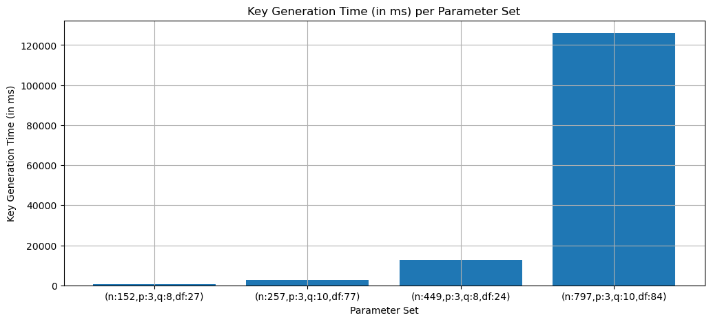

The temporal performance characteristics of NTRU show dramatically different scaling behavior to its key size performance. Key generation time (Figure 8) exhibits substantial growth with parameter size, ranging from nearly instantaneous for the smallest parameter set (under 1,000 ms) to approximately 2,000 ms for the second set, 12,000 ms (12 seconds) for the third set, and reaching approximately 125,000 ms (125 seconds, or just over 2 minutes) for the largest parameter set (n:797).

This significant exponential increase in key generation time reflects the computational complexity of finding suitable polynomial pairs that satisfy NTRU's invertibility requirements. The algorithm must generate random polynomials and verify that they are invertible in both the rings Z/pZ[x]/(x^N-1) and Z/qZ[x]/(x^N-1), which becomes increasingly difficult as N grows larger.

The dramatic jump between the third and fourth parameter sets suggests that the probability of finding valid key pairs decreases substantially at higher dimensions, requiring many more attempts.

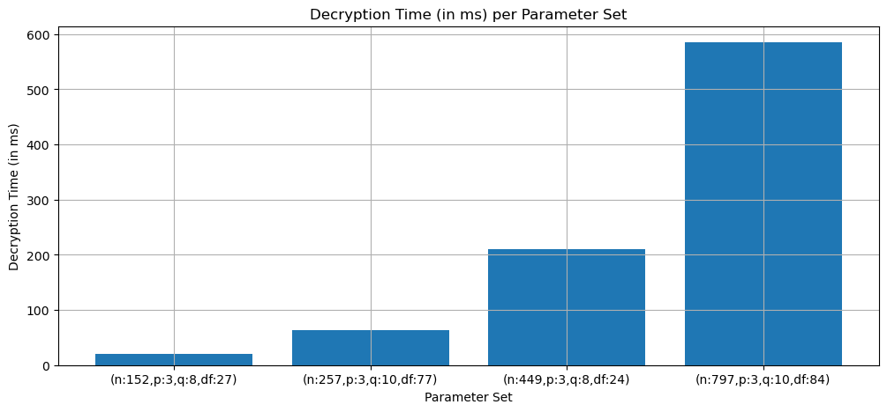

Decryption time (Figure 9) shows more moderate but still substantial exponential growth. The smallest parameter set achieves decryption in approximately 20 ms, the second in roughly 65 ms, the third in about 210 ms, and the largest parameter set requires approximately 590 ms. This progression indicates polynomial time complexity in the degree N, as decryption primarily involves polynomial multiplication and reduction operations in the ring Z/pZ[x]/(x^N-1). While decryption times are roughly comparable to GGH/HNF at similar security levels, the key generation overhead for NTRU is considerably higher, particularly for larger parameter sets.

#### Decryption Success Rate

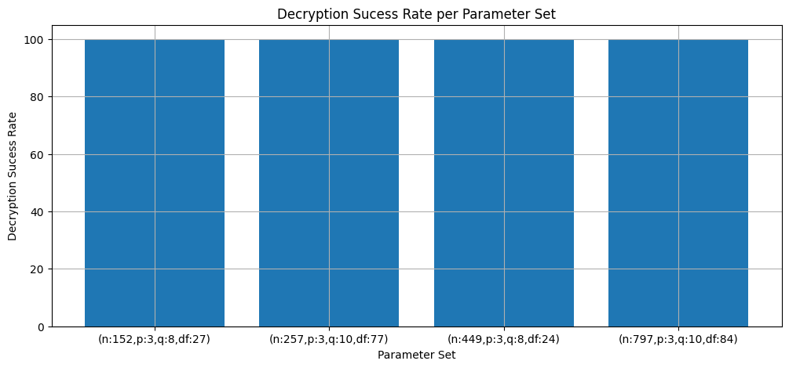

The decryption success rate (Figure 10) demonstrates exceptional reliability across all parameter sets, maintaining a perfect 100% success rate regardless of parameter configuration. This consistent performance stands in stark contrast to GGH/HNF, which exhibited instability at low dimensions. The perfect decryption reliability of NTRU stems from its deterministic decryption procedure and carefully chosen parameters that ensure the decryption polynomial stays within the required bounds.

The parameter choices, particularly the relationship between p, q, and df, are specifically designed to guarantee that decryption failures do not occur. The condition q > (6df + 1)p must be satisfied to ensure decryption always succeeds, and all tested parameter sets clearly meet this criterion. This deterministic correctness is a significant practical advantage of NTRU over GGH/HNF, eliminating the need for error correction mechanisms or parameter adjustment based on empirical failure rates.

#### Analysis of the LLL Attack

The resistance of NTRU to LLL-based lattice attacks was evaluated across all four parameter sets, examining both attack success rates and computational costs.

##### Attack Success Rate

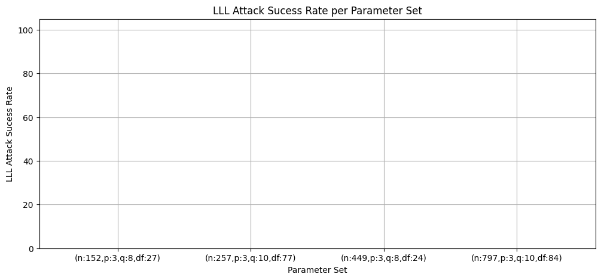

Figure 11 presents a striking result: the LLL attack achieves a 0% success rate across all tested NTRU parameter sets. This complete failure of the attack stands in dramatic contrast to the GGH/HNF results, where LLL attacks succeeded up to dimension 75. The zero success rate indicates that even the smallest NTRU parameter set (n:152) provides sufficient security against standard LLL attacks, demonstrating NTRU's superior resistance to this class of cryptanalysis.

This resilience stems from the specific algebraic structure of NTRU lattices. While NTRU encryption can be formulated as a lattice problem (specifically, a Closest Vector Problem in a particular lattice), the lattice constructed from NTRU public keys has special properties that make standard LLL reduction ineffective. The cyclic structure imposed by working in the quotient ring Z[x]/(x^N-1) creates lattices where short vectors do not directly reveal the private key, unlike in GGH where the private basis vectors themselves are the short vectors sought by LLL.

#### Security Implications
The experimental results demonstrate that NTRU exhibits fundamentally stronger resistance to LLL attacks compared to GGH/HNF. Even the most modest parameter set tested (n:152) completely resists LLL-based cryptanalysis, while GGH/HNF remained vulnerable up to dimension 75-85. This superior security profile allows NTRU to operate at lower parameter sizes while maintaining adequate security margins, directly contributing to its more compact key sizes and competitive performance characteristics.

The primary concern with quantum computing threats applies differently to NTRU than to GGH/HNF. While quantum computers could potentially enhance lattice reduction algorithms, the current complete failure of LLL attacks against NTRU suggests a substantial security buffer. Even if quantum-enhanced algorithms could improve LLL's effectiveness by an order of magnitude, the tested parameter sets would likely remain secure. However, more sophisticated quantum attacks targeting the specific ring structure of NTRU remain a theoretical concern that would necessitate parameter increases in a post-quantum environment. The relatively modest computational overhead of scaling to larger N values makes such parameter increases more feasible for NTRU than the resource-intensive dimension scaling required for GGH/HNF.

### Analysis of the LWE cryptosystem

